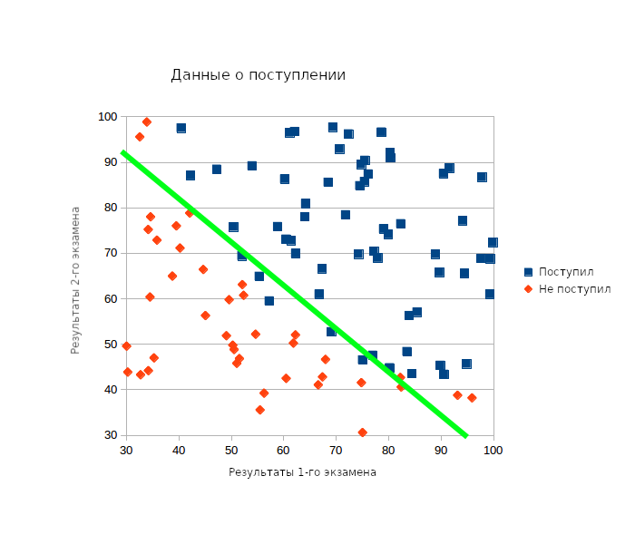
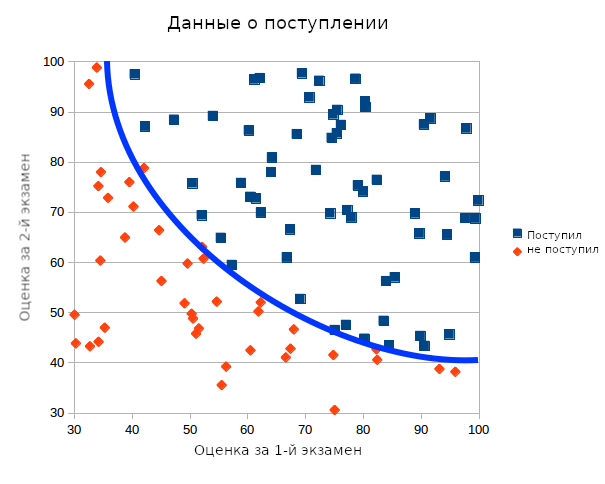

Источник: https://www.practicalai.io/implementing-classification-using-logistic-regression-in-ruby

## Реализация классификации с использованием логистической регрессии[*](../foot-notes/terminology.md#логистическая-регрессия) на Ruby
11.06.2017 автор Soren D

В этой статье мы реализуем простейший алгоритм классификации на Ruby с применением логистической регрессии. Мы будем использовать гем `liblinear-ruby` для установки модели, её обучения и осуществления предсказаний за считанные минуты. В данном примере мы будем использовать данные о поступлении в школу, чтобы оценить вероятность поступления на основании результатов двух экзаменов.

### Данные
Наши данные содержат три ряда для каждого примера - ряды содержат следующие данные:

Результат первого экзамена (от 0 до 100)
Результат второго экзамена (от 0 до 100)
Поступление (1 для поступления, 0 - если не поступил)
Для понимания, что мы можем делать прогнозы на основании этих данных, мы создали XY график.



Глядя на этот график мы можем увидеть, что можно использовать линейную регрессию для разделения данных. Или, говоря другими словами, мы можем провести чёткую линию между двумя классами точек для разделения их и использовать эту линию для предсказания поступления. Я добавил такую зелёную линию на график.

Подобные линии так же называются границами решений. Они могут использоваться для осуществления прогнозов, скажем например для точек выше линии мы прогнозируем поступление, а для точек ниже этой линии студенты с такими результатами приняты не будут.

Не совсем то, что нам нужно, но неплохо для начала. Для вычисления, где провести эту линию мы можем использовать логистическую регрессию. Пример ниже покажет, как это реализовать на Ruby.

### Реализация классификации методом логистической регрессии

Для начала - установим гем [liblinear-ruby](https://github.com/kei500/liblinear-ruby). Гем `liblinear-ruby` предоставляет интерфейс к множеству классификационных функций написанной на C/C++ библиотеке [LIBLINEAR](https://www.csie.ntu.edu.tw/~cjlin/liblinear/). Для установки гема:

```bash
gem install liblinear-ruby
```

Далее - создадим пустой [Ruby файл](../source/example-logistic-linear-regression/example.rb) и подключим гем liblinear и библиотеку CSV.

```ruby
require 'csv'
require 'liblinear'
```

Загрузим наши данные из [CSV файла](../source/example-logistic-linear-regression/data/admission.csv) в два массива. Один двумерный массив будет содержать оценки за экзамены (x_data), а второй одномерный массив будет содержать данные о поступлении (y_data). Оценки за экзамены даны как значения с плавающей точкой, а данные о поступлении - как перечисление (0 - не поступил или 1 - поступил).

```ruby
x_data = []
y_data = []

# Загружаем данные из CSV файла в два массива. Первый - независимые переменные X и второй массив - переменные Y, зависящие от X.
file_name = './data/admission.csv'
CSV.foreach(file_name, :headers => false) do |row|
  x_data.push( [row[0].to_f, row[1].to_f] )
  y_data.push( row[2].to_i )
end
```

Теперь я хочу разделить наши данные на два набора. Первый набор будет использован для обучения алгоритма, а второй - для целей тестирования точности вычислений. Я решил выделить 20% данных на тестирование и оставить 80% на обучение.

```ruby
# Разделение данных на два набора - для обучения и тестирования.
test_size_percentange = 20.0 # 20.0%
test_set_size = x_data.size * (test_size_percentange / 100.0)
test_x_data = x_data[0...test_set_size]
test_y_data = y_data[0...test_set_size]
training_x_data = x_data[test_set_size..x_data.size]
training_y_data = y_data[test_set_size..y_data.size]
```

Тестируя наш алгоритм с тестовыми данными вместо данных для обучения мы можем быть уверены, что алгоритм не переобучен. Здесь мы имеем ввиду, что алгоритм не обучен так, чтобы делать верные прогнозы только на данных обучения, но обучения достаточно, чтобы делать верные прогнозы на данных, которые он никогда не видел ранее.

В этой точке мы имеем наши данные, готовые к работе и мы можем инициализировать модель и обучить её. Мы сделаем это за один проход, используя liblinear:

### Инициализация модели и обучение с использованием данных для обучения

```ruby
model = Liblinear.train(
  { solver_type: Liblinear::L2R_LR },   # Решающее устройство: L2R_LR - L2-упорядоченная логистическая регрессия
  training_y_data,                      # Данные для обучения - результаты классификации
  training_x_data,                      # Данные для обучения - результаты экзаменов
  100                                   # Смещение (диапазон исходных данных)
)
```

Запомните, я инициализировал модель, используя L2 упорядоченную модель логистической регрессии со смещением 100. Другие модели или смещение могут сработать и получше, для вашей специфичной проблемы.

Сейчас мы имеем обученную модель и давайте попробуем сделать прогноз. Мы будем пытаться предсказать, поступит ли студент, если он получил 45 пунктов за первый экзамен и 85 за второй[*](../foot-notes/translators-notes.md#examine-scores-definition).

Алгоритм работает, вычисляя возможность попадания результата в класс 1 (поступил) или 0 (не поступил). Попадание в класс определяется наибольшим приближением к значению класса. Для проверки этих приближений я буду просить модель вернуть возможность попадания модели в каждый класс. Мы будем выводить предсказание возможности в виде процента:

```ruby
# Предсказываемый класс
prediction = Liblinear.predict(model, [45, 85])
# Получить вероятности попадания в класс
probs = Liblinear.predict_probabilities(model, [45, 85])
probs = probs.sort
puts "Алгоритм предсказал класс #{prediction}"
puts "#{(probs[1] * 100).round(2)}% возможность попадания в целевой класс"
puts "#{(probs[0] * 100).round(2)}% возможность попадания в другие классы"
```

Последним шагом нашего простейшего кода будет вопрос к модели о выполнении прогноза для данных, которые мы оставили для тестирования.

Мы будем сравнивать результаты прогноза с оригинальным значением (принят/не принят) для тестового набора данных. Это позволит узнать точность модели, которую мы создали. Мы сделаем предсказания и вычислим их точность:

```ruby
predicted = []
test_x_data.each do |params|
  predicted.push(Liblinear.predict(model, params))
end
correct = predicted.collect.with_index { |predict, index| predict == test_y_data[index] ? 1 : 0 }.inject { |sum, e| sum + e }
puts "Точность: #{(correct.to_f / test_set_size * 100).round(2)}% - размер тестового набора #{test_size_percentange}%"
```

В этой точке мы готовы запустить наш код. Когда он будет выполняться, мы увидим примерно следующее:

```bash
$ ruby example.rb
iter  1 act 2.772e+01 pre 2.400e+01 delta 4.449e+00 f 5.545e+01 |g| 1.556e+03 CG   2
iter  2 act 8.427e+00 pre 6.695e+00 delta 4.449e+00 f 2.773e+01 |g| 4.839e+02 CG   3
iter  3 act 3.291e+00 pre 2.605e+00 delta 4.449e+00 f 1.930e+01 |g| 1.967e+02 CG   3
iter  4 act 1.022e+00 pre 8.555e-01 delta 4.449e+00 f 1.601e+01 |g| 6.576e+01 CG   3
iter  5 act 1.347e-01 pre 1.231e-01 delta 4.449e+00 f 1.499e+01 |g| 1.332e+01 CG   3
Алгоритм предсказал класс 1.0
77.01% возможность попадания в целевой класс
22.99% возможность попадания в другие классы
Точность: 85.0% - размер тестового набора 20.0%
```

Первая группа линий - это вывод от liblinear при обучении нашим алгоритмом.
Далее мы видим, что алгоритм предсказывает, поступим мы или нет, если сдадим первый экзамен на 45 пунктов и второй экзамен на 85 пунктов. Так же вычисляется точность модели на проверочных данных - 85%.

Здесь было показано, как реализовать простейшую линейную логистическую регрессию в Ruby. В следующей статье мы улучшим наш алгоритм, изменив границы решения от линейной к квадратичной зависимости.

### Увеличение точности

Если мы посмотрим на наш график ещё раз, мы сможем увидеть, что прямая линия это не самый лучший способ разделить данные. Возможно некоторая кривизна линии могла бы улучшить иллюстрацию ниже.



Для того, чтобы получить криволинейную границу решения нам нужно изменить функцию принятия решения с линейной на некоторый полином высшего уровня. Для проверки выводы мы заменим данные на квадратичный полином. Для выполнения этого мы поменяем данные в нашей модели логистической регрессии. Прежний массив значений x, содержащий ряд данных:

```
{exam1, exam2}
```

Мы преобразуем так, что на ввод вместо них мы будем подавать квадратичную функцию типа:

```
{exam1, exam12, exam2, exam22, exam1 ∗ exam2}
```

В ruby это значит, чтомы поменяем способ загрузки данных:

```ruby
x_data = []
y_data = []
# Загрузка данных из CSV файла в два массива. Первый массив для независимой переменной X и второй - для зависимой переменной Y
CSV.foreach('./data/admission.csv', headers: false) do |row|
  x_data.push([row[0].to_f, row[0].to_f ** 2, row[1].to_f, row[1].to_f ** 2, row[1].to_f * row[0].to_f])
  y_data.push(row[2].to_i)
end
```

Так же мы поменяем наш пример предсказания так, что теперь он будет получать данные в новом формате:

```ruby
# Класс предсказания
prediction = Liblinear.predict(model, [45, 45 ** 2, 85, 85 ** 2, 45 * 85])
# Получение вероятности предсказаний
probs = Liblinear.predict_probabilities(model, [45, 45 ** 2, 85, 85 ** 2, 45 * 85])
probs = probs.sort
puts "Алгоритм предсказал класс #{prediction}"
puts "#{(probs[1]*100).round(2)}% вероятность попадания в предсказанный класс"
puts "#{(probs[0]*100).round(2)}% вероятность попадания в другой класс"
```

Выполним наш скрипт и посмотрим на вывод:

```bash
$ ruby example.rb
iter  1 act 2.682e+01 pre 2.302e+01 delta 2.089e+00 f 5.545e+01 |g| 1.561e+05 CG   2
iter  2 act 8.514e+00 pre 6.613e+00 delta 2.089e+00 f 2.863e+01 |g| 5.233e+04 CG   3
cg reaches trust region boundary
iter  3 act 6.693e+00 pre 5.242e+00 delta 8.358e+00 f 2.012e+01 |g| 2.226e+04 CG   4
iter  4 act 4.699e+00 pre 3.524e+00 delta 8.358e+00 f 1.342e+01 |g| 1.346e+04 CG   4
iter  5 act 3.200e+00 pre 2.403e+00 delta 8.358e+00 f 8.726e+00 |g| 7.332e+03 CG   4
iter  6 act 2.058e+00 pre 1.557e+00 delta 8.358e+00 f 5.526e+00 |g| 3.035e+03 CG   4
iter  7 act 1.285e+00 pre 9.704e-01 delta 8.358e+00 f 3.468e+00 |g| 1.199e+03 CG   4
Алгоритм предсказал класс 1.0
99.36% вероятность попадания в предсказанный класс
0.64% вероятность попадания в другой класс
Точность: 95.0% - размер тестового набора 20.0%
```

Вы можете заметить, что нахождение правильного вида структуры для данных важно - это специфично для большого числа сложных проблем, которые не могут быть разделены прямой. Чтобы понять, каким образом можно найти лучшую модель и обучить алгоритм - читайте в следующих статьях автора.
