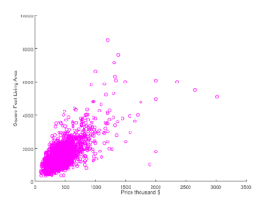
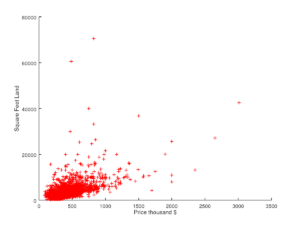

Источник: https://www.practicalai.io/implementing-linear-regression-using-ruby/

## Реализация линейной регрессии[*](../foot-notes/terminology.md#линейная-регрессия) с использованием языка Ruby
11.06.2017 автор Soren D

В этой статье я покажу, как реализовать линейную регрессию на Ruby.
Используя существующие гемы для Ruby мы установим модель линейной регрессии, обучим алгоритм и сделаем предсказания за минуты. Для этого примера мы будем использовать исторические цены на жилые дома в районе Статен Айленд для предсказания цен.

Вы можете найти [код](../source/example-linear-regression/example.rb) и [датасет](../source/example-linear-regression/data/staten-island-single-family-home-sales-2015.csv), использованные в этой статье в [этом репозитории](https://github.com/daugaard/example-linear-regression).


### Получение данных
Как сказано выше, мы будем реализовывать алгоритм машинного обучения для предсказания цен на жилые дома в районе Статен Айленд, основываясь на исторических данных. Для получения исторических данных мы будем использовать [открытый портал данных Нью Йорка](https://opendata.cityofnewyork.us/). Нью Йорк создал прекрасную программу, которая делает данные города доступными для любого желающего.
Эти данные послужат основанием для нашей реализации.

Специфичным для нашей реализации будет то, что мы будем использовать [ежегодно обновляемый набор данных о продажах](https://data.cityofnewyork.us/Housing-Development/Annualized-Rolling-Sales-Update/uzf5-f8n2). Я удалил сильно отличающиеся строки из датасета и отсортировал данные в CSV файле, который выглядит примерно так:

```csv
LAND SQUARE FEET,GROSS SQUARE FEET,SALE PRICE,BOROUGH,NEIGHBORHOOD,TAX CLASS AT PRESENT,BLOCK,LOT,EASE-MENT,BUILDING CLASS AT PRESENT,ZIP CODE,YEAR BUILT,TAX CLASS AT TIME OF SALE,BUILDING CLASS AT TIME OF SALE,SALE DATE
13390,5994,1495000,5,ANNADALE ,1,6475,85, ,A3,10312,2002,1, A3 ,7/28/2015
6180,4808,975000,5,ANNADALE ,1,6370,4, ,A3,10312,1990,1, A3 ,11/20/2015
13406,4180,1199000,5,ANNADALE ,1,5394,4, ,A2,10312,1982,1, A2 ,8/26/2015
8000,4011,865000,5,ANNADALE ,1,6222,54, ,A1,10312,2000,1, A1 ,1/12/2015
30000,4000,470000,5,ANNADALE ,1,6499,40, ,A1,10312,1985,1, A1 ,4/30/2015
```

Первые три колонки представляют для нас наибольший интерес, это: площадь участка в квадратных футах, жилая площадь и цена продажи.




Для лучшего понимания связи между площадью участка, жилой площадью и ценой я создал два графика точек, показывающих отношение жилой площади к цене и отношение площади участка к цене.

Как видно на графиках, жилая площадь и площадь участка определённым образом связаны с ценой в линейной зависимости. Это значит, что мы можем испоьлзовать площадь участка и жилую площадь как независимые переменные для предсказания зависимой переменной цены продажи, используя линейную регрессию.

### Установка зависимостей

В Ruby нет реализованного алгоритма линейной регрессии из коробки. Вместо этого мы используем существующий гем, который реализует алгоритм Линейной Регрессии

Для этого примера мы используем гем [ruby_linear_regression](https://rubygems.org/gems/ruby_linear_regression). Этот гем реализует линейную регрессию, используя реализацию Матриц в Ruby и нормальное распределение, которые позволят нам быстро обучить алгоритм.

Для установки гема запустите:
```bash
gem install ruby_linear_regression
```

После установки гема давайте создадим файл ruby `example.rb` и приступим к реализации.

### Реализация линейной регрессии

Для начала нам нужно подключить ruby библиотеки, с помощью которых мы осуществим реализацию нашего решения. Подключим csv для загрузки данных и ruby_linear_regression для реализации алгоритма регрессии.

```ruby
require ‘csv’
require ‘ruby_linear_regression’
```

Далее нам нужно загрузить исторические данные в два массива. Это будут данные, используя которые мы обучим алгоритм, назовём их Данные обучения. Один массив для независимой переменной `X` (это переменная, на основании которой мы будем предсказывать) и один массив для зависимой переменной `y` (переменная, значение которой мы будем предсказывать).

Мы используем библиотеку CSV для загрузки данных в два массива:

```ruby
x_data = []
y_data = []
# Загружаем данные из CSV file в два массива - один для независимой переменной X и один для зависимой переменной Y
# Каждая строка файла содержит площадь участка и жилую площадь:
# [SQ_FEET_PROPERTY, SQ_FEET_HOUSE]
file_name = './data/staten-island-single-family-home-sales-2015.csv'
CSV.foreach(file_name, headers: true) do |row|
  x_data.push([row[0].to_i, row[1].to_i])
  y_data.push(row[2].to_i)
end
```

Далее, мы инициализируем экземпляр алгоритма линейной регрессии и загрузим данные обучения.

```ruby
# Создаём экземпляр регрессионной модели
linear_regression = RubyLinearRegression.new
# Загружаем данные для обучения
linear_regression.load_training_data(x_data, y_data)
```

В этом месте наши данные загружены в алгоритм и следующим шагом будет обучение алгоритма выполнению предсказаний. Это выполняется просто запуском метода `train_normal_equation`:

```ruby
# Обучим модель, используя нормальное распределение
linear_regression.train_normal_equation
```

С обученным на наших данных алгоритмом машинного обучения мы сможем применить его для осуществления предсказаний. Для выполнения предсказания мы должны создать массив базовых значений и вызвать метод предсказания с каждым элементом массива. Например, это можно сделать так:

```ruby
# Предсказать цену жилого дома с площадью участка 2000 кв. футов и жилой площадью 1500 кв. футов
prediction_data = [2000, 1500]
predicted_price = linear_regression.predict(prediction_data)
puts [
  'Предсказана цена продажи для дома',
  "с площадью участка #{prediction_data.first} кв. футов",
  "и жилой площадью #{prediction_data.second} кв.футов:",
  "$#{predicted_price.round}."
].join(' ')
```

И теперь мы можем запустить программу:

```bash
$ ruby example.rb
ruby example.rb
Cost after 0 iterations = 53793539636.88498
...
Cost after 500 iterations = 10146181598.747213
Цена - нормальное распределение: 10127426888.06452
Цена - градиентный спуск: 10146181598.747213
С помощью линейной регрессии предсказана цена продажи для дома с площадью участка 2000 кв. футов и жилой площадью 1500 кв.футов: $395853.
С помощью градиентной линейной регрессии предсказана цена продажи для дома с площадью участка 2000 кв. футов и жилой площадью 1500 кв.футов: $398827.
```
