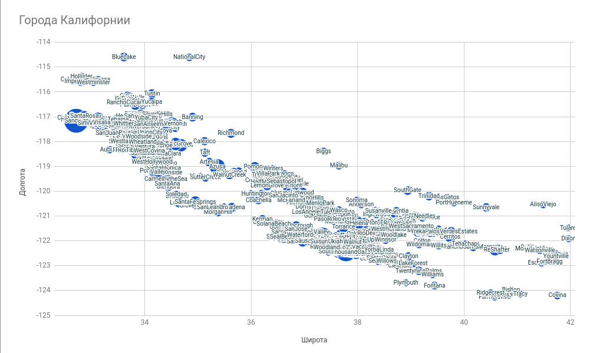
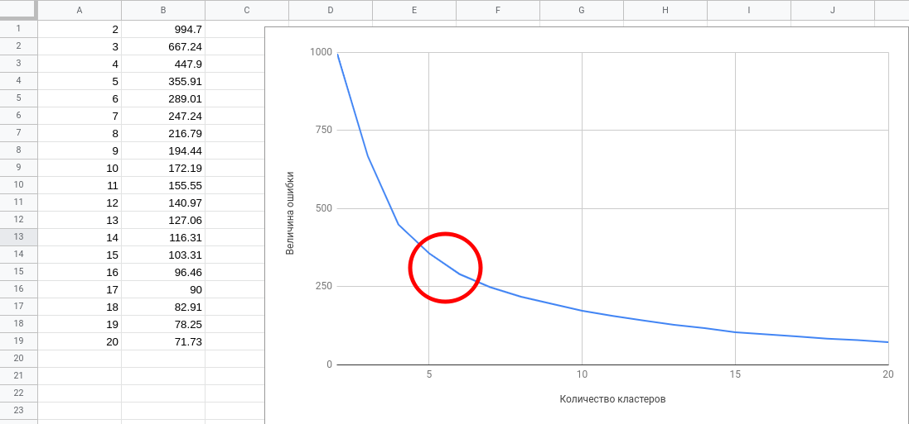
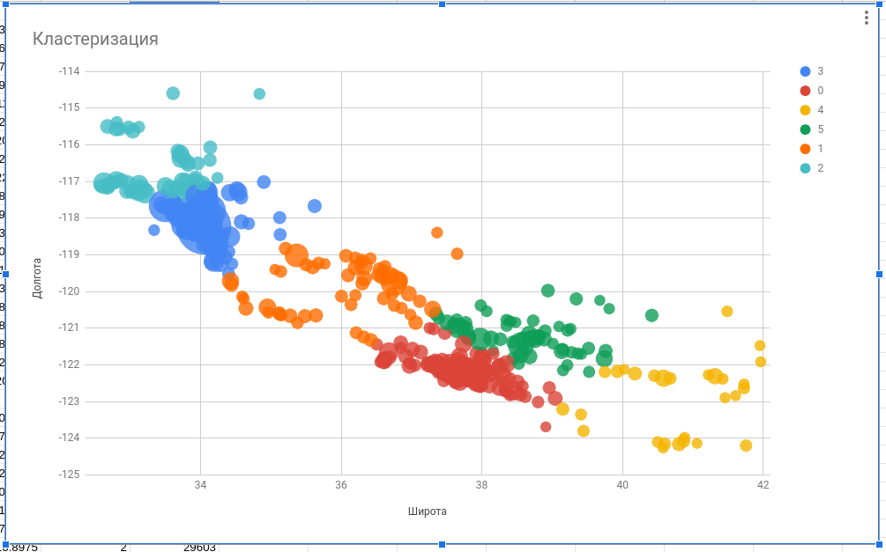

## Обучение без учителя используя метод k-средних на Руби
Июль 31, 2017 от [Soren D](https://www.practicalai.io/unsupervised-learning-using-k-means-clustering-in-ruby)

В этой статье автор будет решать проблему кластеризации используя обучение без учителя, на языке Руби. Будет использован гем [kmeans-clusterer](https://rubygems.org/gems/kmeans-clusterer) для установки проблемы и кластеризации данных методом k-средних.

Алгоритм кластеризации методом k-средних - это алгоритм, использующий неразмеченные данные на некоторое число кластеров, объединяющих группы данных. Этот алгоритм может быть использован для решения маркетинговых задач сегментации, анализа соцсетей, компьютерного кластерный анализа и анализа астрономических данных.

Для нашего примера мы сделаем вид, что открываем дистрибуцию пива в Калифорнии. Мы хотим использовать кластеризацию для того, чтобы поделить рынок на Х территорий дистрибуции (так же называемых кластерами), и найти лучшую позицию для наших центров дистрибуции. Для упрощения проблемы мы будем рассматривать только расположение городов, когда будем делить рынок. Мы будем игнорировать другие факторы, такие как густонаселённость, расположение транспортных артерий и т.д.

## Данные
В качестве входных данных мы будем использовать список 100 наиболее густонаселённых городов в Калифорнии. Города представлены в виде строк, разделённых запятыми и состоящими из следующих колонок:

* Имя
* Широта
* Долгота

Если мы построим график данных, где широта будет отмечена на оси ординат, а долгота будет отмечена на оси абцисс, мы увидим как города формируют собой естественные кластеры. Мы будем использовать кластеризацию методом k-средних для правильного определения кластеров, и определения, как много кластеров мы сможем выделить.


рис. 1: Города Калифорнии для дистрибуции

## Реализация кластеризации методом k-средних

Первым делом установим Руби гем [kmeans-clusterer](https://rubygems.org/gems/kmeans-clusterer). Мы можем добавить его в наш Gemfile или просто установить из командной строки:

```bash
$ gem install kmeans-clusterer
```

Далее мы создадим пустой Руби файл и в первых строках импортируем csv библиотеку для чтения данных и `kmeans-clusterer`:

```ruby
require 'csv'
require 'kmeans-clusterer'
```

Далее мы загрузим данные из csv файла `california-cities.csv` в два массива. Один, называемый `labels` будет содержать имена городов, а второй, называемый `data` будет содержать координаты широты и долготы города.

```ruby
data = []
labels = []
# Загружаем данные из CSV файла в два массива - один для координат широты и долготы, а второй для названий городов
CSV.foreach('./source/common-data/california-cities.csv', headers: true) do |row|
  labels.push row[1]
  data.push [row[2].to_f, row[3].to_f]
end
```

С нашими загруженными данными мы можем установить алгоритм кластеризации методом k-средних и выполнить кластеризацию данных. Если мы захотим разделить данные на три кластера, мы можем сделать это примерно так:

```ruby
k = 3 # Искомое количество кластеров
kmeans = KMeansClusterer.run k, data, labels: labels, runs: 100
kmeans.clusters.each do |cluster|
  puts "Кластер #{cluster.id}"
  puts "Центр кластера: #{cluster.centroid}"
  puts "Города кластера: " + cluster.points.map(&:label).join(', ')
end
```

На выходе мы увидим три кластера с указанием центра кластера (наилучшего места для центра дистрибуции) в широте и долготе, а так же список городов, вошедших в каждый из кластеров:

```bash
Кластер:  0
Центр кластера: [38.53688651218064, -122.06236185383237]
Города кластера: Winters, Vacaville, Dixon, Fairfield, SuisunCity, Woodland, Davis, Yountville, Napa, StHelena, AmericanCanyon, Vallejo, Sonoma, Benicia, Calistoga, Martinez, RioVista, WestSacramento, Pittsburg, Concord, Hercules,
...

Кластер:  1
Центр кластера: [33.86786635410177, -117.71302420041535]
Города кластера: YorbaLinda, ChinoHills, VillaPark, Orange, Placentia, Corona, Chino, Tustin, DiamondBar, Norco, Eastvale, Anaheim, Brea, Pomona, Irvine, Montclair, Ontario, SantaAna, Fullerton, Walnut, LakeForest, Upland, LaHabra, Claremont,
...

Кластер:  2
Центр кластера: [36.342114540466376, -120.31517613168728]
Города кластера: Coalinga, Huron, SanJoaquin, Avenal, Mendota, Kerman, Lemoore, Firebaugh, Madera, Hanford, Fresno, Fowler, DosPalos, Selma, Chowchilla, PasoRobles, Clovis, Kingsburg, Corcoran, KingCity, Parlier, Sanger, LosBanos,
...
```

Хоть этот код и работает, но всё же это не совсем то, что мы хотели. Мы хотели не только поделить города на области дистрибуции, но так же хотели найти оптимальное число таких областей.

Запустить и посмотреть данный код вы можете [тут](https://replit.com/@r72cccp/example-clustering-with-k-means?v=1).

## Нахождение оптимального количества кластеров

Для нахождения оптимального количества кластеров для разделения наших данных мы используем так называемый "Метод локтя". Для использования метода локтя, мы построим график ошибки, используя различное количество кластеров. Ошибка будет показывать, как далеко различные точки находятся далеко от центра их кластера.

Для вычисления ошибки при разном количестве кластеров мы выполним следующее:

```ruby
2.upto(20) do |k|
  kmeans = KMeansClusterer.run k, data, labels: labels, runs: 100
  puts "Количество кластеров: #{k}, Ошибка: #{kmeans.error.round(2)}"
end
```

Программа выведет следующее:

```bash
Количество кластеров: 2, Ошибка: 994.7
Количество кластеров: 3, Ошибка: 667.24
Количество кластеров: 4, Ошибка: 447.9
Количество кластеров: 5, Ошибка: 355.91
Количество кластеров: 6, Ошибка: 289.01
Количество кластеров: 7, Ошибка: 247.24
Количество кластеров: 8, Ошибка: 216.79
Количество кластеров: 9, Ошибка: 194.44
Количество кластеров: 10, Ошибка: 172.19
Количество кластеров: 11, Ошибка: 155.55
Количество кластеров: 12, Ошибка: 140.97
Количество кластеров: 13, Ошибка: 127.06
Количество кластеров: 14, Ошибка: 116.31
Количество кластеров: 15, Ошибка: 103.31
Количество кластеров: 16, Ошибка: 96.46
Количество кластеров: 17, Ошибка: 90.0
Количество кластеров: 18, Ошибка: 82.91
Количество кластеров: 19, Ошибка: 78.25
Количество кластеров: 20, Ошибка: 71.73
```

На графике зависимость ошибки от количества кластеров будет выглядеть примерно так:



Глядя на диаграмму, мы представим, что это рука. Оптимальное количество кластеров будет находиться там, где находится локоть этой воображаемой руки. По нашей диаграмме, это значение примерно 6 кластеров.

Конечно же, это не точная наука и данный метод всего лишь предоставляет нам индикатор, который помогает определить оптимальное количество кластеров. В реальности мы будем должны брать в расчёт и другие факторы, когда определяем количество кластеров.

## Кластеризация данных

Найдя, что оптимальное количество кластеров или центров дистрибуции равняется 6, мы можем выполнить разбиение городов на 7 областей дистрибуции:

```ruby
k = 6 # Оптимальное k найдено с использованием метода локтя
kmeans = KMeansClusterer.run k, data, labels: labels, runs: 100
kmeans.clusters.each do |cluster|
 puts "Кластер № #{cluster.id}"
 puts "Центр кластера: #{cluster.centroid}"
 puts "Города кластера: " + cluster.points.map(&:label).join(', ')
end
```

Запустим код и увидим примерно следующее:

```bash

Кластер № 0
Центр кластера: [37.70046903460838, -122.16895036429875]
Города кластера: SanLeandro, Hayward, Alameda, Piedmont, Moraga, Oakland, Emeryville, FosterCity, Orinda, UnionCity, Lafayette, Berkeley, SanMateo, SanRamon, Danville, Newark, Belmont, SanCarlos, Albany, Burlingame, RedwoodCity, WalnutCreek, Dublin, Hillsborough, EastPaloAlto, Fremont, Atherton,
...

Кластер № 1
Центр кластера: [33.42493939393938, -116.67765656565658]
Города кластера: PalmSprings, RanchoMirage, PalmDesert, CathedralCity, Hemet, IndianWells, Temecula, LaQuinta, SanJacinto, Escondido, Indio, Murrieta, Menifee, Banning, DesertHotSprings, Coachella, SanMarcos, Beaumont, Poway, Vista, Wildomar, Santee, CanyonLake, Perris, Calimesa, Oceanside, ElCajon,
...

Кластер № 2
Центр кластера: [34.01356054711676, -118.06637806610416]
Города кластера: PicoRivera, SouthElMonte, Montebello, Rosemead, Whittier, ElMonte, SantaFeSprings, MontereyPark, SanGabriel, Commerce, TempleCity, Alhambra, Downey, BellGardens, Norwalk, LaPuente, Industry, BaldwinPark, SanMarino, Bell, Arcadia, Maywood, LaHabraHeights, LaMirada, Cudahy,
...

Кластер № 3
Центр кластера: [40.804255952380956, -122.89470238095237]
Города кластера: ShastaLake, Redding, Etna, Anderson, Dunsmuir, MountShasta, Weed, FortJones, RedBluff, Yreka, Montague, BlueLake, Tehama, Corning, Arcata, RioDell, Orland, Eureka, Trinidad, Fortuna, Ferndale, Willits, Dorris, CrescentCity, FortBragg, Ukiah, Tulelake, Alturas

Кластер № 4
Центр кластера: [36.0459868173258, -119.89150828625239]
Города кластера: Avenal, Huron, Lemoore, Corcoran, Hanford, Coalinga, Tulare, Kingsburg, Selma, Fowler, SanJoaquin, Visalia, Parlier, Kerman, Delano,
Reedley, Dinuba, Wasco, Fresno, Farmersville, Sanger, McFarland, Exeter, Clovis, OrangeCove, Lindsay, Shafter, Mendota, PasoRobles, Porterville, Кластер
...

№ 5
Центр кластера: [38.610476851851864, -121.17927777777778]
Города кластера: Folsom, RanchoCordova, CitrusHeights, Roseville, Rocklin, Loomis, ElkGrove, Sacramento, Lincoln, Auburn, WestSacramento, Ione, Plymouth, Galt, Placerville, AmadorCity, SutterCreek, Wheatland, Jackson, Lodi, Colfax, Davis, Woodland, GrassValley, Isleton, Stockton, Dixon,
...
```

Для дальнейшей иллюстрации алгоритма кластеризации выведем на график список городов снова, но в этот раз цвет будет определяться принадлежностью к тому или иному кластеру:



Этот материал показывает, как использовать кластеризацию методом k-средних для проблемы двухмерной кластеризации. Мы назвали эту задачу разделением рынка на несколько областей дистрибуции. Обучение без учителя и кластеризация методом k-средних может быть использована и в других областях, например анализе астрономических данных, анализе соцсетей, анализе связей и др.
