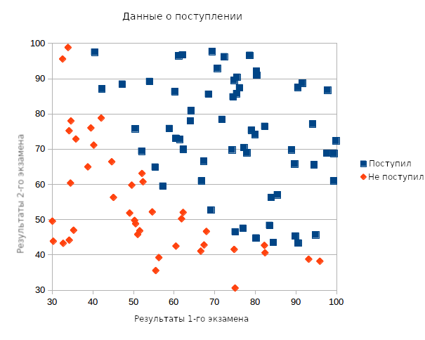

Источник: https://www.practicalai.io/implementing-classification-using-a-svm-in-ruby/

## Реализация классификации с использованием SVM[*](../foot-notes/terminology.md#svm) на Ruby
15.07.2017 автор [Soren D](https://www.practicalai.io/implementing-classification-using-a-svm-in-ruby)

В этой статье автор покажет, как реализовать механизм базового вектора (SVM) на Ruby, и как использовать его для решения задачи простой классификации. Мы используем руби гем [rb-libsvm](https://rubygems.org/gems/rb-libsvm/versions/1.4.0) для установки модели SVM, её обучения и осуществления прогнозов.

Для набора данных мы будем использовать данные о поступлении в школу, это тот же самый набор данных, который мы использовали в задачах [реализации логистической регрессии на Ruby](./Implementing-Classification-using-Logistic-Regression-in-Ruby.md) и [классификации с использованием нейросети](articles/Implementing-Simple-Classification-using-a-Neural-Network-in-Ruby.md) в предыдущих статьях. Так что мы сможем решить, какой подход лучше для решения этой проблемы.

Полный код, использованный в статье находится [тут](../source/example-svm-classification/example.rb).

### Данные
Наши данные содержат три ряда для каждого примера - ряды содержат следующие данные:

Результат первого экзамена (от 0 до 100)
Результат второго экзамена (от 0 до 100)
Поступление (1 для поступления, 0 - если не поступил)
Для понимания, что мы можем делать прогнозы на основании этих данных, мы создали XY график.




### Реализация SVM на Ruby
Перед началом реализации задачи классификации методом опорных векторов, мы установим [rb-libsvm](https://rubygems.org/gems/rb-libsvm/versions/1.4.4) гем. Сам rb-libsvm гем является обёрткой для C библиотеки [libsvm](https://www.csie.ntu.edu.tw/~cjlin/libsvm/). C библиотека LibSVM реализует быструю машину опорных векторов с поддержкой различных ядер. Установим гем:

```bash
gem install rb-libsvm
```

После установки гема создадим [пустой Ruby файл](../source/example-svm-classification/svm_classification.rb) и подключим библиотеки libsvm и csv для загрузки данных.

```ruby
require 'csv'
require 'libsvm'
```

Загрузим данные из CSV файла в массив независимых переменных (результаты экзаменов 1 и 2), называемый x_data и массив для зависимых переменных (результаты поступления) - y_data.

Результаты сдачи экзаменов даны в виде значений с плавающей точкой, а результат поступления даётся в виде двоичного значения (1 для поступивших и 0 для не поступивших). Значения приведены к целым для работы с библиотекой `libsvm`.

```ruby
x_data = []
y_data = []
# Load data from CSV file into two arrays - one for independent variables X and one for the dependent variable Y
CSV.foreach('../common-data/admission.csv', headers: false) do |row|
  x_data.push([row[0].to_f, row[1].to_f])
  y_data.push(row[2].to_i)
end
```

Далее нужно разделить данные на две части - набор для обучения и набор для тестирования обученной модели. Это поможет нам убедиться в том, что машина опорных векторов, которую мы обучим, не переобучилась на нашем наборе данных. Мы разделим данные в соотношении 20% на тестирование и 80% на обучение:

```ruby
# Разделим данные на набор для тестирования и набор для обучения
test_size_percentange = 20.0 # 20.0% для тестирования
test_set_size = x_data.size * (test_size_percentange / 100.0)
test_x_data = x_data[0 .. (test_set_size - 1)]
test_y_data = y_data[0 .. (test_set_size - 1)]
training_x_data = x_data[test_set_size .. x_data.size]
training_y_data = y_data[test_set_size .. y_data.size]
```

Распределив данные мы готовы установить SVM модель. Первым шагом будет определение SVM модели.
With our data ready we are ready to setup our SVM model. The first step is to define the SVM we want to create.

Для нашего примера мы создадим SVM с ядром Гаусса (в библиотеке libsvm она называется RBF (радиальная базовая функция)). Мы установим эпсилон в 0.001, C в 1, а гамма параметр для RBF - в 0.01. Позже мы увидим, хороши ли эти значения для параметров и попытаемся выбрать более подходящие значения.

```ruby
# Установим параметры SVM
parameter = Libsvm::SvmParameter.new
parameter.cache_size = 1 # в мегабайтах
parameter.eps = 0.001
parameter.c = 1
parameter.gamma = 0.01
parameter.kernel_type = Libsvm::KernelType::RBF
```

При настройке параметров модели мы конвертируем наши наборы данных из обычных Ruby массивов в векторы LibSVM. Это нужно для обучения и проверки SVM с использованием rb-libsvm.

```ruby
# Преобразование в векторы LibSVM
test_x_data = test_x_data.map { |feature_row| Libsvm::Node.features(feature_row) }
training_x_data = training_x_data.map { |feature_row| Libsvm::Node.features(feature_row) }
```

Теперь мы имеем данные для обучения, преобразованные во входной формат LibSVM и мы можем определить нашу проблему для libsvm.

Для определения проблемы мы должны предоставить вектора для обучения и ожидаемые результаты:

```ruby
# Определим нашу проблему, используя данные для обучения
problem = Libsvm::Problem.new
problem.set_examples(training_y_data, training_x_data)
```

Определив нашу проблему мы можем обучить SVM модель:

```ruby
# Обучим модель
model = Libsvm::Model.train(problem, parameter)
```

Имея обученную модель мы можем использовать её для осуществления предсказаний. В этом примере мы делаем предсказание о поступлении, если студент сдал первый экзамен на 45 баллов и второй экзамен на 85 баллов. Запомните, что мы конвертировали наши входные параметры в векторы формата livsvm перед тем, как вызвать метод осуществления предсказания.

Предсказывающий метод возвращает класс, так что 0 означает непоступление, а 1 - поступление.

```ruby
# Предсказываем простой класс
prediction = model.predict( Libsvm::Node.features([45, 85]))
# Округлим вывод для осуществления предсказания
puts "Алгоритм предсказал класс: #{prediction}"
```

Сейчас мы знаем, как выполнить предсказание, мы можем измерить точность классификации, используя тестовые данные, которые не видел алгоритм обучения модели. Выполненив предсказания мы сравним каждый результат с реальным результатом поступления.

```ruby
predicted = []
test_x_data.each do |params|
  predicted.push(model.predict(params))
end
correct = predicted.collect.with_index { |e,i| (e == test_y_data[i]) ? 1 : 0 }.inject { |sum, e| sum + e }
puts "Точность классификации: #{((correct.to_f / test_set_size) * 100).round(2)}% - Доля тестового набора #{test_size_percentange}%"
```

Полный исходный код нашего опыта с SVM на Ruby вы можете найти [здесь](source/example-svm-classification/svm_classification_with_parameters.rb).


Запустим код и увидим следующий вывод:

```bash
$ ruby example.rb
Алгоритм предсказал класс: 1.0
Точность классификации: 90.0% - Доля тестового набора 20.0%
```

Точность классификации - 90%. Не очень хорошо. Не сравнить с 95% точностью классификации методом логистической регрессии и тем более не сравнить со 100% результатом при использовании нейросети. В следующей секции мы обсудим, как можно увеличить точность.

Работающий код вы можете посмотреть и запустить [тут](https://replit.com/@r72cccp/example-svm-classification?v=1)

### Нахождение оптимального C и гамма значений для Гауссова SVM ядра
В нашем примере выше мы вышли на 80% точность классификации, используя нашу SVM модель. Это не очень хорошо и мы знаем, что мы можем получить лучшие результаты с доступными данными. Для увеличения точности мы можем изменять значение C и гамма параметры для SVM.

Параметр C похож на упорядоченный параметр λ, с которым мы знакомы из других моделей машинного обучения, только C это величина, обратная λ. Чем больше C, тем меньшее смещение и отклонение модели мы получим, а чем меньше C тем выше смещение и отклонение.

Гамма параметр - это параметр, специфичный для Гауссова ядра (в терминологии libvsm это [RBF](https://www.rubydoc.info/gems/rb-libsvm/1.4.0/Libsvm/SvmParameter#gamma-instance_method)). Гамма параметр определяет, насколько единственный обучающий пример будет иметь влияние на результы примеров, данные которых будут отличаться от обучающего примера.

Для нахождения оптимального C и гамма параметров мы должны написать программу, которая итерирует по возможным значениям C и гамма, измеряет точность классификации для каждой комбинации и находит лучшую комбинацию. По окончании программа будет тестировать выбранную комбинацию C и гамма на незнакомых данных для измерения итоговой точности классификации.

Для этого мы должны разбить наши данные на три части. Обучающий набор, используемый для обучения модели, проверочный набор данных, используемый для проверки комбинаций C и гамма и выбора лучшей комбинации и последний тестовый набор данных для проверки модели, используя C и гамма параметр для нахождения точности классификации. Мы разбили данные в пропорции: 70% на обучающие данные, 15% на проверочные и 15% на тестовые.

## Установка наборов данных
Для импорта данных из CSV файлов, разбиения данных на три набора и преобразования их в векторную форму libvsm пишем следующий код:

```ruby
require 'csv'
require 'libsvm'

x_data = []
y_data = []

# Загружаем данные из CSV файла в два массива - один для независимой переменной X и один для зависимой переменной Y
CSV.foreach('../common-data/admission.csv', headers: false) do |row|
  x_data.push( [row[0].to_f, row[1].to_f] )
  y_data.push( row[2].to_i )
end

# Разбиваем данные на наборы для обучения, проверки и тестирования
validation_size_percentange = 15.0 # 15%
validation_set_size = x_data.size * (validation_size_percentange/100.to_f)
test_size_percentange = 15.0 # 20%
test_set_size = x_data.size * (test_size_percentange/100.to_f)
validation_x_data = x_data[0 .. (validation_set_size-1)]
validation_y_data = y_data[0 .. (validation_set_size-1)]
test_x_data = x_data[validation_set_size .. (validation_set_size+test_set_size-1)]
test_y_data = y_data[validation_set_size .. (validation_set_size+test_set_size-1)]
training_x_data = x_data[(validation_set_size+test_set_size) .. x_data.size]
training_y_data = y_data[(validation_set_size+test_set_size) .. y_data.size]

# Convert into proper feature arrays for Libsvm
validation_x_data = validation_x_data.map {|feature_row| Libsvm::Node.features(feature_row) }
test_x_data = test_x_data.map {|feature_row| Libsvm::Node.features(feature_row) }
training_x_data = training_x_data.map {|feature_row| Libsvm::Node.features(feature_row) }
With the datasets created we can define our problem:

# Определяем нашу проблему, используя данные для обучения
problem = Libsvm::Problem.new
problem.set_examples(training_y_data, training_x_data)
```

## Проверка C и гамма значений
Для проверки C и гамма значений создадим массив возможных значений C и гамма и будем итерировать по обоим.

Мы будем однократно тестировать параметр C в комбинации с гамма параметром. Для каждого теста мы измерим точность классификации используя проверочный набор данных. Если точность, найденная нами будет выше предыдущей, мы сохраним лучшие из найденных значений C и гамма.

## Нахождение лучшей комбинации C и гамма переменных

```ruby
posible_values = [0.0001, 0.0005, 0.0001, 0.0005, 0.001, 0.005, 0.01, 0.05, 0.1, 0.5, 1, 5, 10, 50, 100, 500]
best_c, best_gamma, best_accuracy = 0,0,0
posible_values.each do |test_c|
  posible_values.each do |test_gamma|
    parameter = Libsvm::SvmParameter.new
    parameter.cache_size = 1 # в megabytes
    parameter.eps = 0.001
    parameter.gamma = test_gamma
    parameter.c = test_c
    parameter.kernel_type = Libsvm::KernelType::RBF

    # Обучение модели
    model = Libsvm::Model.train(problem, parameter)
    predicted = []
    validation_x_data.each do |params|
      predicted.push( model.predict(params) )
    end

    correct = predicted.collect.with_index { |e,i| (e == validation_y_data[i]) ? 1 : 0 }.inject{ |sum,e| sum+e }
    accuracy = ((correct.to_f / validation_set_size) * 100).round(2)
    if( accuracy > best_accuracy)
      best_accuracy = accuracy
      best_c = test_c
      best_gamma = test_gamma
      puts "Новое улучшение! Точность классификации: #{accuracy}% - C=#{test_c}, гамма=#{test_gamma}"
    end
  end
end
```

## Тестирование оптимальной комбинации C и гамма параметров
Найдя наилучшее сочетание C и гамма параметров мы можем проверить их на тестовом наборе данных и измерить реальную полученную точности классификации:

```ruby
# Установка оптимальных параметров для модели и вычисление точности классификации
parameter = Libsvm::SvmParameter.new
parameter.cache_size = 1 # в megabytes
parameter.eps = 0.001
parameter.gamma = best_gamma
parameter.c = best_c
parameter.kernel_type = Libsvm::KernelType::RBF

# Обучение модели
model = Libsvm::Model.train(problem, parameter)
predicted = []
test_x_data.each do |params|
  predicted.push( model.predict(params) )
end

correct = predicted.collect.with_index { |e,i| (e == test_y_data[i]) ? 1 : 0 }.inject{ |sum,e| sum+e }
accuracy = ((correct.to_f / test_set_size) * 100).round(2)

puts "Итоговая точность классификации: #{accuracy}% - C=#{best_c}, гамма=#{best_gamma}"
```

Полный код для нахождения лучшей комбинации C и гамма параметров находится [здесь](../source/example-svm-classification)

Выполнение скрипта даёт следующие результаты:

```bash
$ ruby ruby svm_classification_with_parameters.rb
Новое улучшение! Точность классификации: 53.33% - C=0.0001, гамма=0.0001
Новое улучшение! Точность классификации: 73.33% - C=0.1, гамма=0.0005
Новое улучшение! Точность классификации: 80.0% - C=0.1, гамма=0.001
Новое улучшение! Точность классификации: 93.33% - C=0.5, гамма=0.0001
Новое улучшение! Точность классификации: 100.0% - C=500, гамма=0.0005
Итоговая точность классификации: 100.0% - C=500, гамма=0.0005
```

Этот пример показывает, что с корректными параметрами наша SVM модель получает точность классификации 100% на тестовом наборе данных. Это показывает, что Support Vector Machine с Гауссовым ядром может быть настолько точной, чтобы удовлетворить наш запрос, как нейросеть.

Работающий экземпляр кода вы можете посмотреть и запустить [тут](https://replit.com/@r72cccp/example-svm-classification-with-parameters?v=1).

Для того, чтобы увидеть решение той же проблемы классификации, используя нейросеть, читайте [следующую статью](./Implementing-classification-with-neural-network-in-Ruby.md). ([оригинал на сайте автора](http://www.practicalai.io/implementing-simple-classification-using-neural-network-in-ruby))
To see how this problem was solved using a neural network read this blog post.
