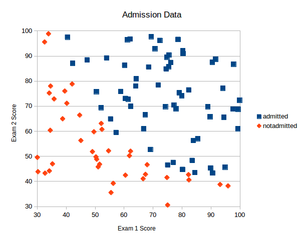

Источник: http://www.practicalai.io/implementing-simple-classification-using-neural-network-in-ruby

## Реализация классификации с использованием нейросети на Ruby

3 июля, 2017 от [Soren D](http://www.practicalai.io/implementing-simple-classification-using-neural-network-in-ruby/#)

В этой статье будет показано, как использовать нейросети в Руби для решения задачи простейшей классификации. Для установки нейросети будет использован гем [ruby-fann](https://github.com/tangledpath/ruby-fann), обучение и осуществление предсказаний займёт несколько минут вашего внимания.
  Для нашего примера будет использован набор данных о поступлении в школу, этот же набор данных был использован в [предыдущем примере](http://www.practicalai.io/implementing-classification-using-logistic-regression-in-ruby/) для реализации задачи классификации с использованием логистической регрессии. Благодаря этому мы сможем сравнить результаты и определить, что лучше подходит для решения задачи - Логистическая регрессия или Нейросеть.

Полный пример кода вы можете увидеть в [репозитории](https://github.com/daugaard/example-neural-network) автора статьи.

## Данные

Мы будем использовать данные о поступлении в школу в виде трёх колонок:

* Результат 1 экзамена (от 0 до 100)
* Результат 2 экзамена (от 0 до 100)
* Поступление (1 - поступил, 0 - не поступил)

Отобразив эти данные на графике мы сможем увидеть, что существует корреляция между результатами экзаменов и поступлением. Так что мы можем решить проблему, используя эти данные и нейросеть.



## Архитектура нейросети

Перед реализацией Нейросети мы должны определиться с архитектурой сети, которую хотим построить. Мы будем строить трёхслойную нейросеть, используя следующие правила:

* Входной слой: 2 узла (результаты 1 и 2 экзаменов);
* Скрытый слой 1: 6 скрытых узлов;
* Выходной слой: 1 узел
  * так как выходные значения нейросети не двоичные, то мы будем использовать округление для получения результата. Если выходное значение < 0.5, мы будем классифицировать его как непоступление в школу. Результат 0.5 и выше будет расцениваться как поступление.
Обратите внимание, что определение архитектуры нейросети не является точной наукой. Мы можем позже пожелать изменить количество узлов в нашем скрытом слое и увидеть, как это будет влиять на конечные результаты и производительность нейросети.

## Установка нейросети на Руби

На этом шаге мы подготовимся к реализации нейросети на Руби. Для начала мы установим гем [ruby-fann](https://github.com/tangledpath/ruby-fann). Ruby-fann это гем, который предоставляет интерфейс к FANN (Fast Artifical Neural Network) - `Быстрой искуственной Нейросети`. FANN является проектом с открытым исходным кодом, библиотекой нейросети, реализующей многослойные искусственные нейросети с поддержкой сильно-связанных и слабо-связанных сетей.

Для установки гема, добавим его к нашему Gemfile и запустим бандлер или установим гем в терминале:

```bash
gem install ruby-fann
```

Создадим пустой руби файл и затребуем нужные модули - ruby-fann и CSV для загрузки данных.

```ruby
require 'csv'
require 'ruby-fann'
```

Загрузим данные из CSV файла в массив в массив из двух независимых переменных (результаты 1 и 2 экзаменов), называемые `x_data`, и одну зависимую переменную (результат поступления) `y_data`.

Оценки за экзамены даны в значениях типа float, а результат поступления дан как двоичное значение - 1 для поступления, 0 для непоступления. Отметим, что мы обернули данные о факте поступления в массив перед тем, как поместить их в массив y_data. Такая структура нужна потому, что FANN работает с массивами данных для входных и выходных значений.

```ruby
x_data = []
y_data = []

# Загружаем данные из CSV в два массива - один для независимых переменных X и второй - для зависимой переменной Y
CSV.foreach('../common-data/admission.csv', headers: false) do |row|
  x_data.push [row[0].to_f, row[1].to_f]
  y_data.push [row[2].to_i]
end
```

Перед установкой и обучением Нейросети мы должны разделить данные на данные для обучения и данные для тестирования. Это поможет нам быть уверенным, что молель, которую мы обучаем не будет переобучена на наших данных. Для данного примера мы выделили 20% на данные для тестирования и 80% на данные для обучения. Мы разделим данные примерно так:

```ruby
# Разделим данные на набор для обучения и набор для тестирования
test_size_percentange = 20.0 # 20.0%
test_set_size = x_data.size * test_size_percentange / 100.to_f
test_x_data = x_data[0..(test_set_size - 1)]
test_y_data = y_data[0..(test_set_size - 1)]
training_x_data = x_data[test_set_size..x_data.size]
training_y_data = y_data[test_set_size..y_data.size]
```

С готовыми данными мы можем установить и обучающую модель данных. Ruby-fann требует загрузить данные для обучения в класс TrainData:

```ruby
# Установим данные для обучения:
train = RubyFann::TrainData.new(inputs: training_x_data, desired_outputs: training_y_data)
```

> Обратите внимание, что вывод будет представлять собой двумерный массив, если у Нейросети будет один выходной узел. Такой формат данных нужен для поддержки нейросетей с несколькими выходными узлами.

Далее мы установим модель Нейросети с архитектурой, принятой ранее. Мы установим 2 входных узла, 1 скрытый уровень с шестью узлами и 1 выходной узел:

```ruby
# Установим модель нейросети и обучим её
model = RubyFann::Standard.new num_inputs: 2, hidden_neurons: [6], num_outputs: 1
```

Установив модель нейросети мы можем обучить её на данных для обучения, сформированных ранее. Мы обучим модель за максимум 5000 итераций и каждые 500 итераций мы попросим FANN вывести ошибку и прервём процесс обучения, если ошибка снизится до 0.01.

```ruby
# 5000 итераций, 500 итераций между отчётом об ошибке errors и 0.01 ожидаемое среднеквадратичное отклонение
model.train_on_data(train, 5000, 500, 0.01)
```

Вывод значения ошибки в процессе обучения является хорошим инструментом диагностики. Ошибка должна снижаться по мере обучения модели. Если ошибка не снижается, мы должны остановить обучение и переопределить архитектуру нейросети, задав конфигурацию, являющуюся наилучшим решением для наших данных.

С нашей моделью мы можем начать выполнять предсказания - в данном примере мы пытаемся предсказать, поступит студент или нет, по результатам 1 и 2 экзаменов, 45 и 85 соответственно:

```ruby
# Предсказание
prediction = model.run [45, 85]

# Округлим результат к двоичному значению
puts "Алгоритм предсказал результат: #{prediction.map(&:round)}"
```

Выполнение предсказания осуществляется простым вызовом `model.run` с данными. Для вывода о поступлении ученика мы должны округлить результат до двоичного значения.

Для определения точности созданной нами модели мы запустим предсказания на всём тестовом наборе данных подряд и сравним полученные результаты предсказаний с реальным результатом поступления:

```ruby
predicted = []
test_x_data.each do |params|
  predicted.push model.run(params).map(&:round)
end
correct = predicted.collect.with_index { |e, i| e == test_y_data[i] ? 1 : 0 }.sum { |sum, e| sum + e }
puts "Точность: #{(correct.to_f / test_set_size * 100).round(2)}% - размер тестовых данных #{test_size_percentange}%"
```

Запуск ruby файла в терминале даст нам следующий вывод:

```bash
$ ruby source/example-neural-network-classification/example.rb

Max epochs     5000. Desired error: 0.0099999998.
Epochs            1. Current error: 0.2428484857. Bit fail 80.
Epochs          500. Current error: 0.0416569188. Bit fail 12.
Epochs         1000. Current error: 0.0351180881. Bit fail 7.
Epochs         1500. Current error: 0.0255497787. Bit fail 6.
Epochs         2000. Current error: 0.0185005907. Bit fail 5.
Epochs         2500. Current error: 0.0165432543. Bit fail 3.
Epochs         3000. Current error: 0.0166908912. Bit fail 3.
Epochs         3500. Current error: 0.0163695328. Bit fail 4.
Epochs         4000. Current error: 0.0165428519. Bit fail 4.
Epochs         4500. Current error: 0.0158606954. Bit fail 4.
Epochs         5000. Current error: 0.0148453470. Bit fail 2.
Алгоритм предсказал результат: [1]
Точность: 100.0% - Размер тестового набора данных 20.0%
```

Работающий код из этого примера вы можете посмотреть и запустить [тут](https://replit.com/@r72cccp/example-neural-network-classification?v=1).
