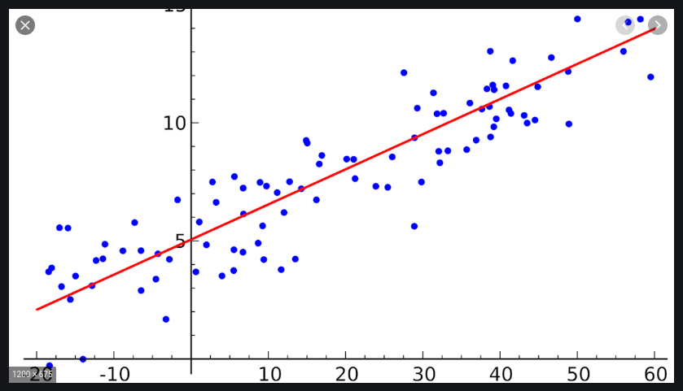

## Терминология

### <a name="linear-regression">Линейная регрессия</a>

Задачей линейной регрессии является нахождение коэффициентов уравнения

```
y = kx + b
```
где k - угол наклона прямой, b - сдвиг по оси y

Исходными данными является набор точек, например:


