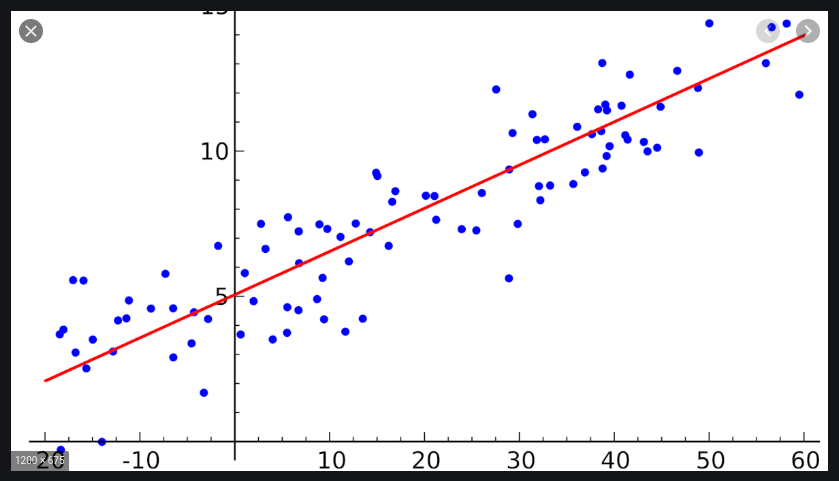
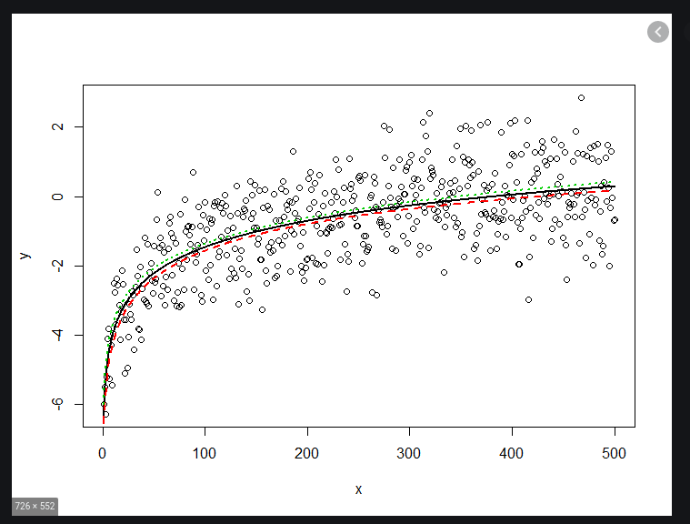

## Терминология

### <a name="linear-regression">Линейная регрессия</a>

Задачей линейной регрессии является нахождение коэффициентов уравнения

```
y = kx + b
```
где k - угол наклона прямой, b - сдвиг по оси y

Исходными данными является набор точек, например:




### <a name="logistic-regression">Логистическая регрессия</a>

Задачей логистической регрессии является нахождение вероятности некоторого события по значениям множества признаков. В случае одной пары переменных x, y функция зависимости выражается как:

```
         1
y = ------------
     1 + e<sup>-x</sup>
```

Исходными данными является набор точек, например:


