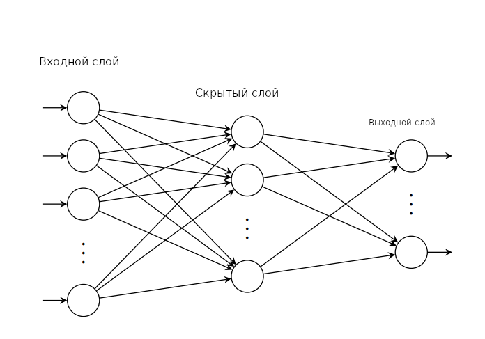
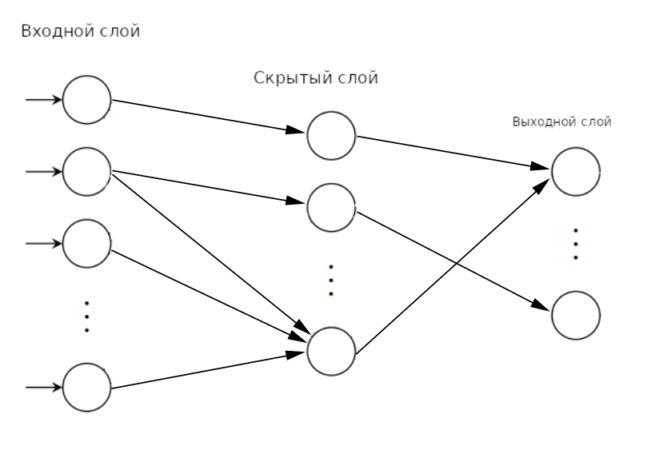

## Терминология

### Линейная регрессия

Задачей линейной регрессии является нахождение коэффициентов уравнения

```
y = kx + b
```
где k - угол наклона прямой, b - сдвиг по оси y

Исходными данными является набор точек, например:


### Логистическая регрессия

Задачей логистической регрессии является нахождение вероятности некоторого события по значениям множества признаков. В случае одной пары переменных x, y функция зависимости выражается как:

```
         1
y = ------------
     1 + e<sup>-x</sup>
```

Исходными данными является набор точек, например:


### Полносвязанная нейросеть



Полносвязанная нейросеть состоит из некоторого набора полностью соединённых слоёв. Каждый полностью соединённый слой представляет собой функцию R(m) => R(n). Где каждое из выходных значений R(n) зависит от каждого из входных значений R(m).

### Слабосвязанная нейросеть



Слабосвязанная нейросеть представляет собой набор слоёв, в которых входные значения связаны только с некоторыми из выходных значений.
